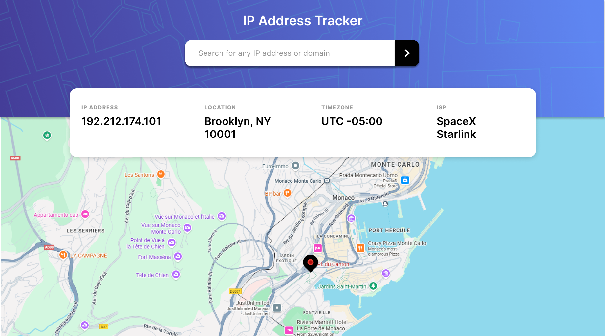

# IP Address Tracker

#### A frontend web application that allows users to look up IP address information in real time.




## Description

This project is a Frontend Mentor challenge implemented with HTML, CSS, and JavaScript.
The app takes a user-entered IP address, calls a geolocation API, and displays details such as location, time zone, and ISP, along with a visual map.

## Table of Contents

- [Technologies Used](#technologiesused)  
- [Features](#features)  
- [Whiteboard Images](#whiteboard)  
- [Trello Planning](#trello)  
- [Design](#design)  
- [Project Next Steps](#nextsteps)  
- [Deployed App](#deployment)  
- [About the Author](#author)  
- [Works Cited](#works-cited)  
- [Notes](#notes) 
- [Reflections] (#reflections) 

## <a name="technologiesused"></a>Technologies Used

- HTML  
- CSS  
- JavaScript  
- API Integration  
- Figma  
- Materialize  

## <a name="features"></a>Features

- Users can enter an IP address and receive the corresponding location, time zone, and ISP information.
- The app integrates with a geolocation API to fetch and display real-time IP data.
- Results are shown in a clean, responsive layout designed for both desktop and mobile users.

## <a name="whiteboard"></a>Whiteboard Images

- Whiteboard and planning images can be found in the project Images folder.

## <a name="trello"></a>Trello Planning

- Project planning and task breakdown are documented in Trello:  
  https://trello.com/invite/b/69270b4653bea864a89eb95a/ATTI78c7509bf86288930be7049f9bad23abF1BE0CB6/my-trello-board.

## <a name="design"></a>Design

- The layout and visual design were created in Figma, then translated from Figma to code.
- Initial structure was built with plain HTML and then refactored using Materialize and custom CSS for styling and responsiveness.

## <a name="nextsteps"></a>Project Next Steps

- Allow users to search by domain name in addition to IP address.
- Enhance error handling and validation for invalid or private IP addresses.
- Add loading states and subtle animations to improve the user experience.

## <a name="deployment"></a>Deployed Link

- Live Page:  
  [https://cfra8189.github.io/ip-address-tracker/](https://cfra8189.github.io/ip-address-tracker/)

- Git Repository:  
  [https://github.com/cfra8189/ip-address-tracker.git](https://github.com/cfra8189/ip-address-tracker.git)

## <a name="author"></a>About The Author

Clarence S. Franklin Jr. is a self-taught developer and creative artist based in Kennesaw, GA, transitioning into a new career in software engineering. He recently completed the Per Scholas Software Engineering Program, building a foundation in full-stack JavaScript with a focus on real-world, project-based learning. With a background in music production and coaching, Clarence approaches web development as a way to turn abstract ideas into tangible, useful tools for everyday people.

You can find more of his work here:  
- Portfolio: https://www.luctheleo.com/  
- GitHub: https://github.com/cfra8189  
- LinkedIn: https://www.linkedin.com/in/luctheleo/

## <a name="works-cited"></a>Works Cited

- 1.4: JSON – Working with Data and APIs in JavaScript  
  https://www.youtube.com/watch?v=uxf0--uiX0I&t=774s

- 1.5: Mapping Geolocation with Leaflet.js – Working with Data and APIs in JavaScript  
  https://www.youtube.com/watch?v=nZaZ2dB6pow

- How to FETCH data from an API using JavaScript  
  https://youtu.be/37vxWr0WgQk?si=dfkBnbexH3weIu0b

- MDN Navigator API  
  https://developer.mozilla.org/en-US/docs/Web/API/Navigator

- MDN CSS !important reference  
  https://developer.mozilla.org/en-US/docs/Web/CSS/Reference/Values/important

- CSS positioning reference  
  https://jwmyss.csb.app/

## <a name="notes"></a>Notes

These notes document key concepts used in this project and support the assignment requirements.

### API Integration

- An access key is a security code that acts like a digital ID and password for software programs, allowing them to securely talk to online services without a person having to log in manually.
  - Authentication: It proves the program is allowed to be there and confirms its identity.
  - Authorization: It defines what the program is allowed to do and grants specific permissions.
  - The pair usually has two parts: an ID (username) and a secret key (password).

- Set the ApiKey and UserIP before the ApiURL:  
  You set the security codes (ApiKey and UserIP) before the destination address (ApiURL) because the system needs to know who you are and what you are requesting before it contacts the endpoint.

### Leaflet

- Leaflet is a free, open-source JavaScript library for interactive maps that does not require an API key or an API URL for its core functionality.

### ASYNC Functions for Fetching Data

Example 1:

```js
async function fetchData() {
  {
    try {
      await fetch(`https://pokeapi.co/api/v2/pokemon/${pokemonName.value}`)
        .then((res) => res.json())
        .then((data) => {
          console.log(data);
        });
    } catch (error) {
      // handle error
    } finally {
      // cleanup or final steps
    }
  }
}
```

Example 2:

```js
async function searchIp(ip) {
  const response = await fetch(
    `https://geo.ipify.org/api/v2/country,city?apiKey=${apiKey}&ipAddress=${ip}`
  );
  const data = await response.json();
  console.log(data);

  try {
    // handle successful data usage
  } catch (error) {
    // handle error
  } finally {
    // cleanup or final steps
  }
}
```

These examples illustrate how to use `async/await` with `fetch` to request data from APIs, handle responses, and prepare for proper error handling and cleanup logic in real applications.

### Custom CSS

- This link helped deepen understanding of CSS positioning:  
  https://jwmyss.csb.app/.

- To move items on a webpage manually using CSS, set the element's `position` property and then use `top`, `bottom`, `left`, or `right` to place it.
  - `position: relative;` moves an element relative to where it would normally sit; the original space remains reserved.
  - `position: absolute;` removes the element from the normal document flow and positions it relative to its nearest positioned ancestor, so other elements ignore its space.

## <a name="reflections"></a>Reflections

The concept of this project was simple, but the journey to the MVP was a bit challenging and long. I just had to create a simple page that takes a plain IP address and turn it into something visual data on the screen. I began with the basics, building out the layout with HTML and CSS and using a Figma design as my reference. From there, I wired up the JavaScript to handle user input, call the geolocation API, and update the page and map based on the response.​

One of my biggest challenges was refactoring the Figma-to-code output into something I could actually use in my project. Because I didn’t label anything in Figma or use auto layout, the code export gave me a wall of nested divs with tons of inline styles, and it took hours to sort through and restructure it into cleaner HTML and CSS. I also had to juggle Materialize with my own custom styles—using Materialize mainly for responsiveness while still fighting some of its default classes to get the layout looking right.​​

On the JavaScript side, getting comfortable with fetch, async functions, and parsing JSON from the API response was another learning curve, but working through docs and examples helped things click. If I had more time, I would improve the user experience by adding clearer error states, loading indicators, and support for domain lookups, and I’d spend time refactoring the codebase to be more modular and reusable so it’s easier to extend later.